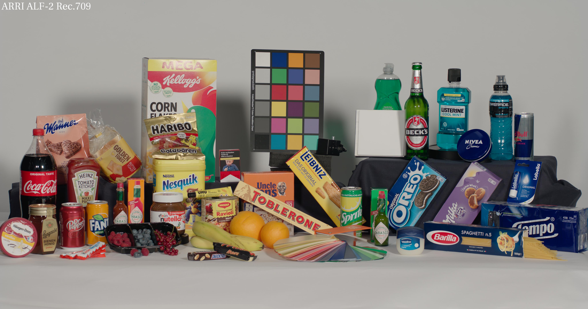

# Images with Looks

All images that have LMT applied to them were applied with [ocioconvert](https://opencolorio.org/) from
the CLF files.

# Source images

Source images were acquired from the following open sources:

- [ACES Gamut Mapping Virtual Working Group Image Submissions](https://www.dropbox.com/sh/u6z2a0jboo4vno8/AAB-10qcflhpr0C5LWhs7Kq4a)
- [Arri Camera Sample Footage](https://www.arri.com/en/learn-help/learn-help-camera-system/camera-sample-footage)
